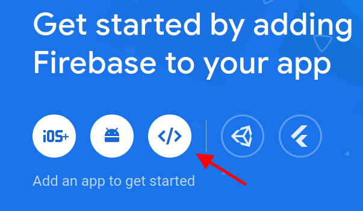
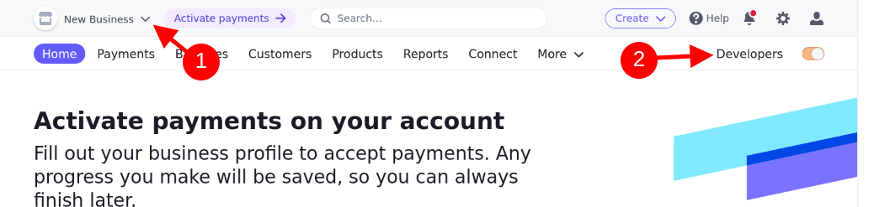

# Connecting Stripe Webhooks to Firebase Cloud Functions on localhost using localtunnel.

I recently built a project which utilized a Firebase cloud function to process Stripe Payment Intent events sent by a Stripe webhook. 

Setting up the cloud function on Firebase and the webhook on Stripe were both pretty straight-forward and getting the two connected in production was relatively intuitive as well. However, I quickly realized that there wasn't a way to test the connection locally without using the cloud function in the production environment.

The Stripe CLI is able to both trigger and listen for webhooks, but the result of the webhook was being sent to my local terminal, rather than Firebase, so my cloud function wasn't being triggered when the webhook was fired. 

The solution involves using a service like `ngrok` or, in my case, `localtunnel` to [open a TCP server that listens for connections from my app and pipes the data to my local machine](https://stackoverflow.com/a/53180742/12316752). 

I found a few useful guides online for connecting `ngrok` to Stripe, including `ngrok`'s [Official Guide](https://ngrok.com/docs/integrations/webhooks/stripe), but I had a hard time finding documentation that integrated Firebase cloud functions into the mix. 

Firebase's documentation has a section on [running functions locally](https://firebase.google.com/docs/functions/local-emulator#instrument_your_app_for_https_functions_emulation), so this post is going to tie the two together so that the cloud functions will trigger in local the Firebase functions emulator.

I will assume the reader has a general knowledge of React and Firebase. I won't walk through I will show ## Install Dependencies

## Project Setup

Go into the Google Console and create a new project. Cloud functions are only available with the "Pay-as-You-Go" plan, so upgrade the project to use a Blaze plan.


I'll be using the latest Node LTS release, `16.18.0`, via `nvm`.

```
$ nvm use 16.18.0
```

Install the Firebase CLI

```
$ npm i g firebase-tools
```

Create a React app with `create-react-app`

```
$ npx create-react-app firebase_stripe_tunnel
```

Navigate into the project's root directory.

```
$ cd firebase_stripe_tunnel
```

On the Firebase console homepage for the project, go through the steps to add a web app to the project. 



After giving a nickname for the app, install the Firebase SDK

```
$ npm install firebase
```

You'll also see a block of code to configure the Firebase SDK in React. I've removed some things from the following block for brevity. 

Create a file called `.env.local` in the root directory, move all sensitive values into it and store them in variables prefixed with `REACT_APP_` so they'll be accessible in the React app.

```javascript
// Import the functions you need from the SDKs you need
import { initializeApp } from "firebase/app";

// Your web app's Firebase configuration
const firebaseConfig = {
  apiKey: process.env.REACT_APP_FIREBASE_API_KEY,
  authDomain: process.env.REACT_APP_FIREBASE_AUTH_DOMAIN,
  projectId: process.env.REACT_APP_FIREBASE_PROJECT_ID,
};

// Initialize Firebase
const app = initializeApp(firebaseConfig);
```

Create a folder called `firebase` and paste the code to initialize the app in a file called `client.js` inside the folder.

## 

## Setup Stripe

Install the Stripe CLI 

- Sign up for Stripe and create a new account and navigate the the developers page.
- 
