# Connecting Stripe Webhooks to Firebase Cloud Functions on localhost using localtunnel.

## Table of Contents

- [Project Setup](#project-setup)
- [Setup Stripe](#setup-stripe)
- [Environment Variables](#environment-variables)
- [Payment Intent Cloud Function](#payment-intent-cloud-function)
- [Firebase Functions Emulator](#firebase-functions-emulator)
- [React UI](#react-ui)
- [Stripe Event Cloud Function](#stripe-event-cloud-function)
- [Localtunnel](#localtunnel)
- [Final Thoughts](#final-thoughts)

I recently built a project which utilized a Firebase cloud function to process Stripe Payment Intent events sent by a Stripe webhook.

Setting up the cloud function on Firebase and the webhook on Stripe were both pretty straight-forward and getting the two connected in production was relatively intuitive as well. However, I quickly realized that there wasn't a way to test the connection locally without using the cloud function in the production environment.

The Stripe CLI is able to both trigger and listen for webhooks, but the result of the webhook was being sent to my local terminal, rather than Firebase, so my cloud function wasn't being triggered when the webhook was fired.

The solution involves using a service like `ngrok` or, in my case, `localtunnel` to [open a TCP server that listens for connections from my app and pipes the data to my local machine](https://stackoverflow.com/a/53180742/12316752).

I found a few useful guides online for connecting `ngrok` to Stripe, including `ngrok`'s [Official Guide](https://ngrok.com/docs/integrations/webhooks/stripe), but I had a hard time finding documentation that integrated Firebase cloud functions into the mix.

Firebase's documentation has a section on [running functions locally](https://firebase.google.com/docs/functions/local-emulator#instrument_your_app_for_https_functions_emulation), so this post is going to tie the two together so that the cloud functions will trigger in local the Firebase functions emulator.

The Stripe portion of this post for creating and manipulating Payment Intents in React follows [this guide](https://stripe.com/docs/payments/accept-a-payment?platform=web&ui=elements) from the Stripe docs for implementing a custom payment workflow.

## Project Setup

[Back to top](#table-of-contents)

If you've already got a Firebase project setup, you can jump to [Stripe Setup](#setup-stripe). If you also already have a UI and are just interested in handling Stripe events using a cloud function in the Firebase emulator, skip to [Setting Up `localtunnel`](#setting-up-localtunnel).

Go into the Google Console and create a new project. Cloud functions are only available with the "Pay-as-You-Go" plan, so upgrade the project to use a Blaze plan.


I'll be using the latest Node LTS release, `16.18.0`, via `nvm`.

```
$ nvm use 16.18.0
```

Install the Firebase CLI

```
$ npm i g firebase-tools
```

Create a React app with `create-react-app`

```
$ npx create-react-app firebase_stripe_tunnel
```

Navigate into the project's root directory.

```
$ cd firebase_stripe_tunnel
```

On the Firebase console homepage for the project, go through the steps to add Firebase to a web app.


After giving a nickname for the app, install the Firebase SDK.

```
$ npm install firebase
```

You'll also see a block of code to configure the Firebase SDK in React. I've removed some things from the following block for brevity.

Create a file called `.env.local` in the root directory, move all sensitive values into it and store them in variables prefixed with `REACT_APP_` so they'll be accessible in the React app.

Create a folder in the `src` folder called `firebase` and paste the code to initialize the app in a file called `client.js` inside the folder.

```javascript
/* src/firebase/client.js */

import { initializeApp } from "firebase/app";

// Your web app's Firebase configuration
const firebaseConfig = {
  apiKey: process.env.REACT_APP_FIREBASE_API_KEY,
  authDomain: process.env.REACT_APP_FIREBASE_AUTH_DOMAIN,
  projectId: process.env.REACT_APP_FIREBASE_PROJECT_ID,
  // ... other config items
};

// Initialize Firebase
const app = initializeApp(firebaseConfig);
```

Let's also initialize Firebase functions for the project.

```
$ firebase init functions
```

If the CLI asks you if you want to install the Functions emulator, say yes, as we will need that later.

## Setup Stripe

Navigate into the `functions` folder created after initiallizing Firebase functions and install Stripe as a dependency.

```
$ cd functions && npm i stripe
```

Sign up for Stripe and create a new account. I've called mine "Firebase Stripe Tunnel".

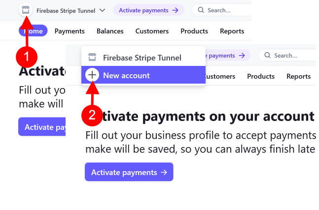

Install the [Stripe CLI](https://stripe.com/docs/stripe-cli#install) and log in.

```
$ stripe login
```

The Stripe CLI has the ability to listen for events for the logged in account using the command `stripe listen`.

```
$ stripe listen
> Ready! You are using Stripe API Version [2022-08-01]. Your webhook signing secret is whsec_2daa0b0897f50f... (^C to quit)
```

The CLI is now listening for all Stripe events.

We can check this connection by opening a new terminal instance and running `stripe trigger` with the type of event to trigger:

```
$ stripe trigger payment_intent.create
Setting up fixture for: payment_intent
Running fixture for: payment_intent
Trigger succeeded! Check dashboard for event details.
```

Checking the terminal instance where the Stripe CLI is listening, we should see that it heard the `payment_intent.create` event.

```
2022-10-19 00:57:48   --> payment_intent.created [evt_3LuX9sL22OGCkxBP1aVSPHti]
```

## Environment Variables

The CLI also provides a signing secret to validate the events. Let's save this as an environment variable inside the `functions` folder. Inside the `functions` folder, run:

```
echo -e "\nSTRIPE_HANDLE_EVENT_SECRET_DEVELOPMENT=$(stripe listen --print-secret)" >> .env
```

The [`--print-secret`](https://stripe.com/docs/cli/listen#listen-print-secret) flag will cause Stripe to output the signing secret and quit. The `-e` flag is to allow `echo` to process the `\n` escape character and add a new line before the value.

> **Note**: The CLI signing secret will be _different_ each time you log in with the CLI, so this value will have to be updated in `.env` to test webhooks locally.

While we're at it, let's add a few more environment variables. One for the Stripe secret key provided on the Stripe dashboard, one for the webhook signing secret for our production environment (we'll fill this in later) and one to indicate that we're in a development environment

The Stripe secret key found on the Stripe dashboard will also be set as an environment variable so it can be used in the cloud functions.

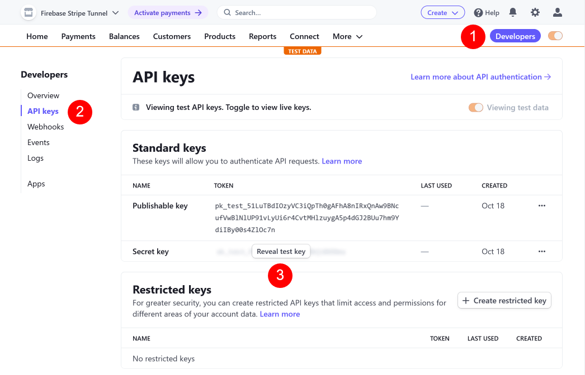

```
NODE_ENV=DEVELOPMENT
STRIPE_SECRET_KEY=sk_test_51LuTBdIO...
STRIPE_HANDLE_EVENT_SECRET_DEVELOPMENT=whsec_
STRIPE_HANDLE_EVENT_SECRET_PRODUCTION=""
```

The environment variable names are arbitrary, but will be used in the cloud function to dynamically load the key based on the value of `NODE_ENV`.

Right now the connection is only between Stripe and the local terminal instance. Let's create a cloud function to create a Payment Intent.

## Payment Intent Cloud Function

As mentioned in the introduction for this post, the process for creating and manipulating Stripe Payment Intents will follow the Node.js examples from [this guide](https://stripe.com/docs/payments/accept-a-payment?platform=web&ui=elements).

```javascript
/* functions/index.js */

const functions = require("firebase-functions");
const admin = require("firebase-admin");

admin.initializeApp();

exports.handleStripeEvent = functions.https.onCall((data, context) => {
  // create Payment Intent here
});
```

This is pretty much straight from the docs for [writing a callable cloud function](https://firebase.google.com/docs/functions/callable#write_and_deploy_the_callable_function). Let's add our Stripe logic to this. First we'll set grab the Stripe secret from `functions/.env`.

```javascript
/* functions/index.js */

const functions = require("firebase-functions");
const admin = require("firebase-admin");

// initialize Stripe client
const stripe = require("stripe")(process.env.STRIPE_SECRET_KEY);

admin.initializeApp();

exports.createPaymentIntent = functions.https.onCall((data, context) => {
  // create Payment Intent here
});
```

Now we're ready to create our Payment Intent.

```javascript
/* functions/index.js */

const functions = require("firebase-functions");
const admin = require("firebase-admin");

// initialize Stripe client
const stripe = require("stripe")(process.env.STRIPE_SECRET_KEY);

admin.initializeApp();

exports.createPaymentIntent = functions.https.onCall(async (data, context) => {
  try {
    const paymentIntent = await stripe.paymentIntents.create({
      amount: data.amount,
      currency: "usd",
      automatic_payment_methods: { enabled: true },
    });

    // destructure desired values
    const { client_secret: clientSecret, id } = paymentIntent;

    return {
      id,
      clientSecret,
      message: "Created",
    };
  } catch (error) {
    throw new functions.https.HttpsError("unknown", error);
  }
});
```

We'll pass the `amount` for the payment **as an integer** when call the function.

The `clientSecret` will be used in React to render the Stripe Payment Elements that will process the payment.

## Firebase Functions Emulator

Let's spin up the Firebase emulator to test our function. For now we'll only be running the functions emulator, but other emulators will need to be started as other features are added to the project such as authentication, storage or Firestore.

Run the following command, replacing `<PROJECT_NAME>` with the name of your project. You can find the name by running `$ firebase projects:list`.

```
$ firebase emulators:start --only functions --project <PROJECT_NAME>
```

This should start up the functions emulator which will intercept calls to the cloud functions and run them locally, but there's one more step to get this to work.

In `src/firebase/client.js`, we'll connect our app to the emulator.

```javascript
// Import the functions you need from the SDKs you need
import { initializeApp } from "firebase/app";
import { getFunctions, connectFunctionsEmulator } from "firebase/functions";

// Your web app's Firebase configuration
const firebaseConfig = {
  // ...
};

// Initialize Firebase
const app = initializeApp(firebaseConfig);

const functions = getFunctions(app);

// connect emulators in developement
if (window.location.hostname === "localhost") {
  connectFunctionsEmulator(functions, "localhost", 5001);
}

// export initialized functions for use in other parts of the app
export { functions };
```

I'm using the browser's `window.location.hostname` to determine whether or not to connect the emulator. The functions emulator started on port `5001`, but it might be different on your machine.

Now we can make an HTTP call to our function with `curl` or another HTTP client.

According to the [Firebase docs](https://firebase.google.com/docs/functions/local-emulator#instrument_your_app_for_https_functions_emulation), the path to the function is as follows:

```
http://$HOST:$PORT/$PROJECT/us-central1/$FUNCTION_NAME
```

This is almost identical to the function's URL trigger which is generated when the function is deployed.

Let's try it.

```
$ curl -X POST http://localhost:5001/fir-stripe-tunnel/us-central1/createPaymentIntent \
 -H "Content-Type: application/json" \
 -d '{"data": {"amount": 999}}' \
 | json_pp -json_opt pretty,canonical

{
  "result": {
    "id" : "pi_3Lufb2IOzyVC3iQp1iJYuADC",
    "clientSecret" : "pi_3Lufb..._secret_hYJsX..."
    "message": "Created"
  }
}
```

Sweet! Our function is working! If we check the Stripe dashboard in the Payments section, we should see the Payment Intent we just created and that the amount and ID match those returned in the terminal.

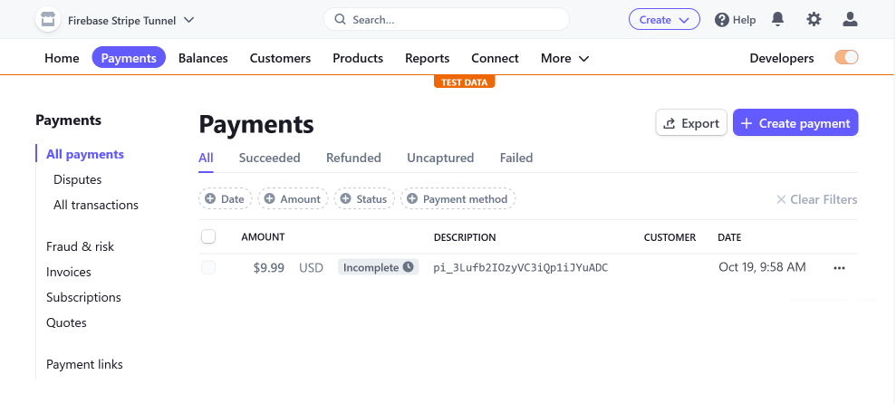

Breaking down the command:

- `curl -X POST http://localhost:5001/fir-stripe-tunnel/us-central1/createPaymentIntent`

  Make a `POST` request to our function's `localhost` path (`fir-stripe-tunnel` is the name of my app).

- `-H "Content-Type: application/json"`

  Sets the `Content-Type` header to send/receive JSON

- `-d '{"data": {"amount": 999}}'`

  Attach JSON data to the request. The `data` attribute aligns with the `data` parameter in our cloud function so `data.amount` can be used to create the Payement Intent.

- `| json_pp -json_opt pretty,canonical`

  Pipes the resulting JSON data through `json_pp` for pretty formatting. The `canonical` option keeps the data in a predictable order.

Let's also add a cloud function to cancel the Payment Intent.

```javascript
/* functions/index.js */

exports.cancelPaymentIntent = functions.https.onCall(async (data, context) => {
  const { id } = data;
  try {
    await stripe.paymentIntents.cancel(id);
    return { id, message: "Canceled" };
  } catch (error) {
    throw new functions.https.HttpsError("unknown", error);
  }
});
```

## React UI

We don't want to interact with our cloud functions using `curl`, so let's build a minimal UI to trigger our Payment Intent events. If you already have UI are just interested in handling Stripe events using a cloud function in the Firebase emulator, skip to [Setting Up `localtunnel`](#setting-up-localtunnel).

I'm going to assume the reader has a general knowledge of React and not explain the UI code too much. As stated in the introduction, this portion basically follows [this guide](https://stripe.com/docs/payments/accept-a-payment?platform=web&ui=elements) for integrating Stripe in React.

Install dependencies.

```
$ npm i @stripe/react-stripe-js @stripe/stripe-js react-router-dom react-hook-form
```

We'll need to add the Stripe publishable key to `src/.env.local`.

```
REACT_APP_STRIPE_PUBLISHABLE_KEY=pk_test_51LuTBdI...
```

For the sake of brevity, I'm not going to show all the files in the React app. For instance, the `useContext` will be used to manage global state to avoid prop drilling. The `AppContext` will manage the `paymentIntent` object returned from the cloud functions, a list of `products` and a boolean `loadingProducts` to indicate if the request to fetch the products is pending. None of this will be shown.

Let's start with `App.js`.

- Create and set up the `AppContext` provider.
- Use `ProductsProvider` to fetch fake products from [DummyJSON](https://dummyjson.com/) and store them in the context object.
- Three routes will be used
  - `"/"` - Product form
  - `"/checkout"` - Checkout form
  - `"/thank-you"` - Thank you page after confirming payment
- `<Navbar />` - To navigate the routes
- `<PaymentIntentInfo />` - Display status of existing Payment Intent object (created | updated | canceled)

```javascript
/* App.js */

import { useReducer } from "react";
import { Routes, Route } from "react-router-dom";
import "./App.css";
import { AppContext, initialState } from "./store";
import { appReducer } from "./store/reducer";
import ProductsProvider from "./components/Products/Provider";
import Navbar from "./components/Navbar";
import PaymentIntentInfo "./components/PaymentIntentInfo";
import Products from "./components/Products";
import Checkout from "./components/Checkout";
import ThankYou from "./components/ThankYou";

function App() {
  const [state, dispatch] = useReducer(appReducer, initialState);

  return (
    <AppContext.Provider value={{ state, dispatch }}>
      <ProductsProvider>
        <div className="App">
          <main className="container">
            <Navbar />
            <PaymentIntentInfo />
            <Routes>
              <Route path="/" element={<Products />} />
              <Route path="/checkout" element={<Checkout />} />
              <Route path="/thank-you" element={<ThankYou />} />
            </Routes>
          </main>
        </div>
      </ProductsProvider>
    </AppContext.Provider>
  );
}

export default App;
```

A reusable hook called `useHttpsCallable` will be used for calling the cloud functions. It accepts the name of the cloud function as an argument and returns an object with attributes:

- `loading` - A boolean to track the loading state of the function once it's called
- `error` - The error from the function call if it fails.
- `call` - A version of the function that's callable within the app

```javascript
import { useState } from "react";
import { functions } from "../firebase/client";
import { httpsCallable } from "firebase/functions";

export const useHttpsCallable = (functionName) => {
  const [loading, setLoading] = useState(false);
  const [error, setError] = useState(null);

  const executeCallable = async (data) => {
    const callable = httpsCallable(functions, functionName);
    try {
      setLoading(true);
      const response = await callable(data);
      return response.data;
    } catch (error) {
      setError(error);
    } finally {
      setLoading(false);
    }
  };

  return {
    loading,
    error,
    call: executeCallable,
  };
};
```

A form will be used to generate the `amount` of the Payment Intent. The `useHttpsCallable` hook is used in the `submitHandler` function used as the `onSubmit` callback for the form.

The actual rendering of the form has been obfuscated into a separate component that won't be shown here, but it basically just renders input fields for each of the products, connects them with `react-hook-form`, and calls the `submitHandler` when the form is submitted.

```javascript
/* src/components/Products/index.js */

import React, { useContext, useMemo } from "react";
import { useNavigate } from "react-router-dom";
import { AppContext } from "../../store";
import { setPaymentIntent } from "../../store/actions";
import { useHttpsCallable } from "../../hooks/useHttpsCallable";
import Form from "./Form";

const Products = () => {
  const navigate = useNavigate();

  const { state, dispatch } = useContext(AppContext);
  const { products, loadingProducts } = state;

  // create callable version of the createPaymentIntent cloud function
  const createPaymentIntent = useHttpsCallable("createPaymentIntent");

  const stripeLoading = useMemo(
    () => createPaymentIntent.loading,
    [createPaymentIntent]
  );
  const submitHandler = async (formData) => {
    // add up the product totals
    const amount = products.reduce(
      (total, product) => total + formData[product.title] * product.price,
      0
    );

    if (amount > 0) {
      // call the cloud function to create a new
      // Payment Intent with the calculated total
      const paymentIntent = await createPaymentIntent.call({
        amount: amount * 100,
      });
      dispatch(setPaymentIntent(paymentIntent));
      navigate("/checkout");
    }
  };

  return !products || loadingProducts ? (
    "Loading products..."
  ) : (
    <Form submitHandler={submitHandler} stripeLoading={stripeLoading} />
  );
};

export default Products;
```

Once the Payment Intent is created, the `Checkout` component will be rendered. This is implemented almost exactly as shown in the Stripe implementation guide.

```javascript
/* src/components/Checkout/index.js */

import React, { useContext, useEffect } from "react";
import { useNavigate } from "react-router-dom";
import { Elements } from "@stripe/react-stripe-js";
import { loadStripe } from "@stripe/stripe-js";
import { AppContext } from "../../store";
import Form from "./Form";

const Checkout = () => {
  const navigate = useNavigate();
  const { state } = useContext(AppContext);
  const { paymentIntent } = state;

  const stripePromise = loadStripe(
    process.env.REACT_APP_STRIPE_PUBLISHABLE_KEY
  );

  // navigate to the products form if no Payment Intent exists
  useEffect(() => {
    if (!paymentIntent) {
      navigate("/");
    }
  }, [paymentIntent, navigate]);

  if (!paymentIntent) {
    return;
  }

  return (
    <Elements
      stripe={stripePromise}
      options={{ clientSecret: paymentIntent?.clientSecret }}
    >
      <Form />
    </Elements>
  );
};

export default Checkout;
```

And the Checkout form

```javascript
/* src/components/Checkout/Form.js */

import React, { useContext, useState } from "react";
import { useNavigate } from "react-router-dom";
import {
  useStripe,
  useElements,
  PaymentElement,
} from "@stripe/react-stripe-js";
import { AppContext } from "../../store";
import { setPaymentIntent } from "../../store/actions";
import styles from "./Checkout.module.css";

const Form = () => {
  const navigate = useNavigate();
  const { dispatch } = useContext(AppContext);
  const stripe = useStripe();
  const elements = useElements();

  const [loading, setLoading] = useState(false);
  const [error, setError] = useState(null);

  const handleSubmit = async (e) => {
    e.preventDefault();

    if (!stripe || !elements) {
      return;
    }

    setLoading(true);
    const { error } = await stripe.confirmPayment({
      elements,
      redirect: "if_required",
    });
    setLoading(false);

    if (error) {
      setError(error);
    } else {
      dispatch(setPaymentIntent(null));
      navigate("/thank-you");
    }
  };

  const cancelPaymentIntent = useHttpsCallable("cancelPaymentIntent");

  const handleCancel = async (e) => {
    try {
      const response = await cancelPaymentIntent.call({
        id: paymentIntent?.id,
      });
      dispatch(setPaymentIntent(response));
      navigate("/");
    } catch (error) {
      console.log(error);
    }
  };

  return (
    <form onSubmit={handleSubmit} className={styles.checkoutForm}>
      {error ? <p className={styles.error}>{error.message}</p> : ""}
      <PaymentElement />
      <button disabled={!stripe || loading} className={styles.submitButton}>
        {loading ? "Submitting..." : "Submit"}
      </button>
      <Link to="/" onClick={handleCancel} className={styles.cancelLink}>
        Cancel
      </Link>
    </form>
  );
};

export default Form;
```

If all goes according to plan, the form should now be able to create and complete the Payment Intent process.


Check the Stripe dashboard to see if the Payment Intent got created

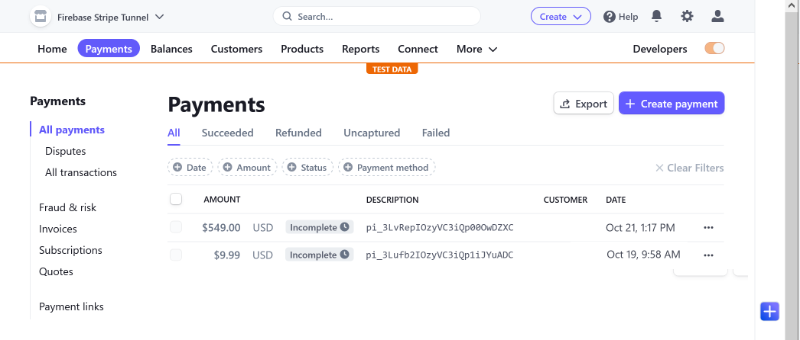

Then fill out the form and click submit to complete the Payment Intent

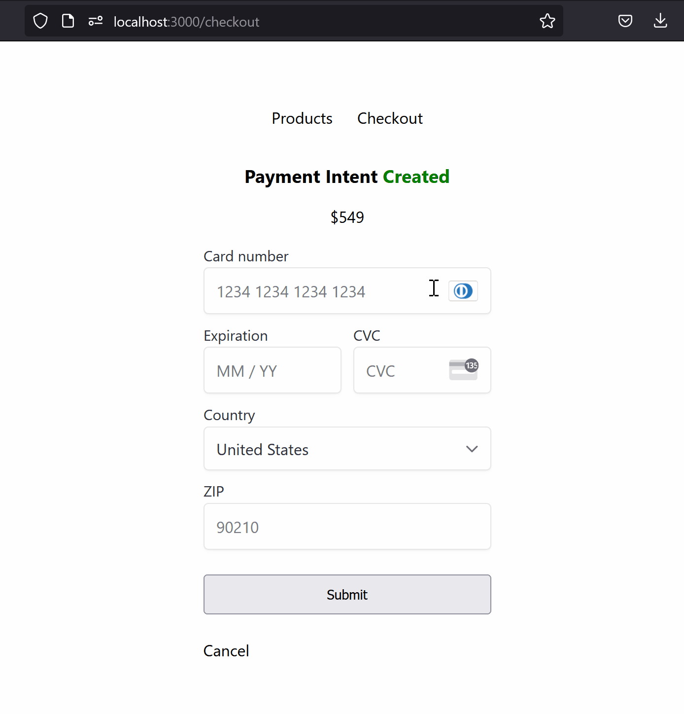

Check the Stripe dashboard to see if the Payment Intent got completed

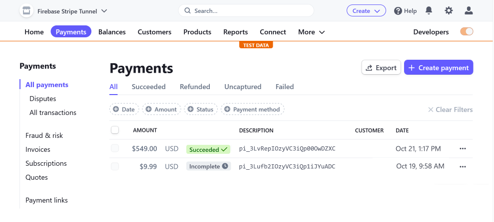

Great! Now it's time to send the Stripe events to a Firebase cloud function.

## Stripe Event Cloud Function

```javascript
/* functions/index.js */

exports.handleStripeEvent = functions.https.onRequest((req, res) => {
  // event handling logic here
});
```

This is pretty much straight the same as the function to create the Payment Intent, but using `onRequest` instead of `onCall` because we won't be calling this function directly from our app.

Next, we'll set grab the Stripe signing secret from `functions/.env`. The signing secret will be different for the production webhook, so we'll use the value of `NODE_ENV` (either `DEVELOPMENT` or `PRODUCTION`) to define it dynamically.

```javascript
/* functions/index.js */

const functions = require("firebase-functions");
const admin = require("firebase-admin");
const stripe = require("stripe")(process.env.STRIPE_SECRET_KEY); // initialize Stripe client

admin.initializeApp();

// grab signing secret from functions/.env
const { NODE_ENV } = process.env;
const stripeSigningSecret =
  process.env[`STRIPE_HANDLE_EVENT_SECRET_${NODE_ENV}`];

exports.handleStripeEvent = functions.https.onRequest((req, res) => {
  // event handling logic here
});
```

Next we'll construct the Stripe event from the `stripe-signature` header passed with the request in combination with the signing secret.

```javascript
/* functions/index.js */

const functions = require("firebase-functions");
const admin = require("firebase-admin");
const stripe = require("stripe")(process.env.STRIPE_SECRET_KEY); // initialize Stripe client

admin.initializeApp();

// grab signing secret from functions/.env
const { NODE_ENV } = process.env;
const stripeSigningSecret =
  process.env[`STRIPE_HANDLE_EVENT_SECRET_${NODE_ENV}`];

exports.handleStripeEvent = functions.https.onRequest((req, res) => {
  let signature = req.headers["stripe-signature"];

  let event;
  try {
    event = stripe.webhooks.constructEvent(
      req.rawBody,
      signature,
      stripeSigningSecret
    );

    // logic to handle the event here

    res.send();
  } catch (error) {
    throw new functions.https.HttpsError(
      "unknown",
      `Error constructing Stripe event: ${error}`
    );
  }
});
```

When a webhook is created in the Stripe dashboard, the Node.js boilerplate code uses `req.body` intead of `req.rawBody`. The Stripe `constructEvent` function requires a buffer object as the body and the cloud function's `req.body` object will cause an error because it is a JSON string. I also added a bit of error handling, just in case.

Now we can add a switch statement to handle the various event types.

```javascript
const functions = require("firebase-functions");
const admin = require("firebase-admin");
const stripe = require("stripe")(process.env.STRIPE_SECRET_KEY); // initialize Stripe client

admin.initializeApp();

// grab signing secret from functions/.env
const { NODE_ENV } = process.env;
const stripeSigningSecret =
  process.env[`STRIPE_HANDLE_EVENT_SECRET_${NODE_ENV}`];

exports.handleStripeEvent = functions.https.onRequest((req, res) => {
  let signature = req.headers["stripe-signature"];

  let event;
  try {
    event = stripe.webhooks.constructEvent(
      req.rawBody, // req.body will cause an error
      signature,
      stripeSigningSecret
    );

    let paymentIntent = null;
    switch (event.type) {
      case "payment_intent.created":
        paymentIntent = event.data.object;
        functions.logger.log("Payment Intent Created", paymentIntent.id);
        break;

      // handle other intent event types

      default:
        functions.logger.log("Unhandled event type", event.type);
        break;
    }

    res.send();
  } catch (error) {
    throw new functions.https.HttpsError(
      "unknown",
      `Error constructing Stripe event: ${error}`
    );
  }
});
```

Once everything is set up, the `functions.logger.log()` statements will output in the Firebase logs in production and in the functions emulator logs in development.

## Localtunnel

`localtunnel` can be installed globally or as a project dependency, but we'll run it using `npx`.

```
$ npx localtunnel --port 5001

your url is: https://empty-rocks-taste-67-189-33-164.loca.lt
```

The port number is the port number used by the Firebase functions emulator. Copy the URL that's generated.

If the Stripe CLI is still running, stop it. The Stripe CLI will be started again, but this time it will be directed to forward requests to our `localtunnel` URL.

```
$ stripe listen --forward-to https://empty-rocks-taste-67-189-33-164.loca.lt/<YOUR_PROJECT_NAME>/us-central1/handleStripeEvent
```

Make sure the signing secret that is printed in the terminal is stored in the environment variable in `functions/.env` under the name `STRIPE_HANDLE_EVENT_SECRET_DEVELOPMENT`.

Heading back to the browser, let's make another Payment Intent.

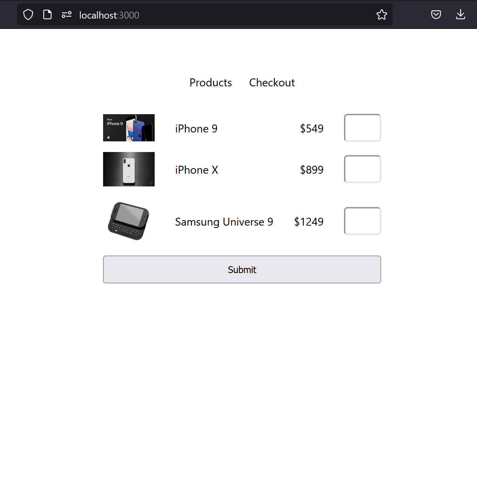

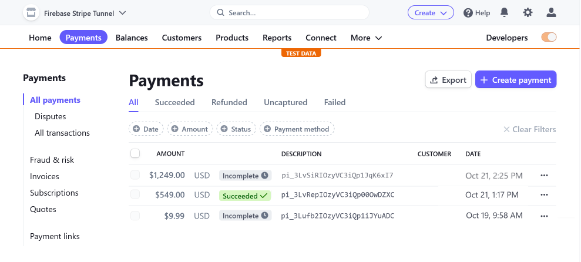

Checking the Stripe CLI, we'll see that not only did the `payment_intent.created` event get triggered, but also that our `handleStripeEvent` function was called through the `localtunnel` URL.

```
2022-10-21 14:25:20   --> payment_intent.created [evt_3LvSiRIOzyVC3iQp1SdNTE9Z]
2022-10-21 14:25:25  <--  [200] POST https://empty-rocks-taste-67-189-33-164.loca.lt/fir-stripe-tunnel/us-central1/handleStripeEvent [evt_3LvSiRIOzyVC3iQp1SdNTE9Z]
```

If we check the Firebase emulator logs at [http://localhost:4000/logs](http://localhost:4000/logs)

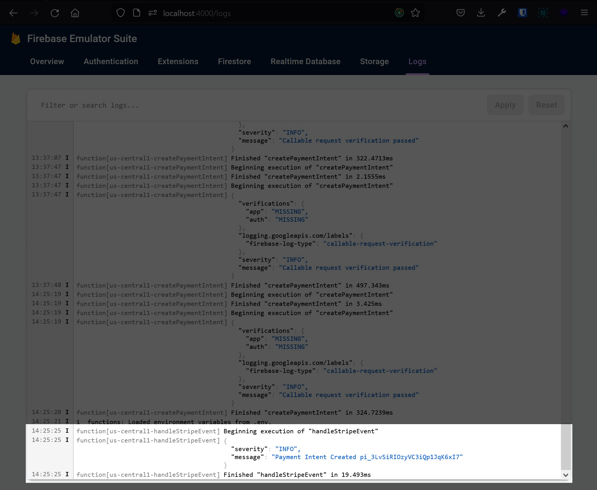

Hooray! There is a ton of information stored inside the `event` object passed from Stripe including any `metadata` included in the Payment Intent when it was created.

If we complete the Payment Intent

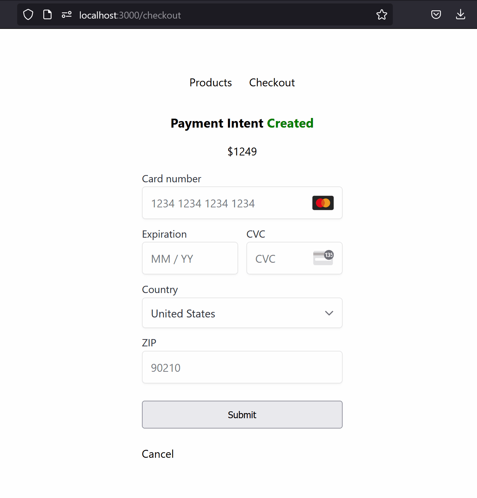

Stripe

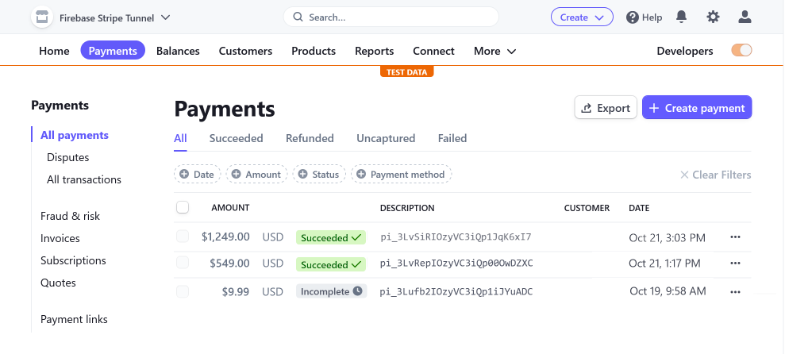

Firebase emulator logs
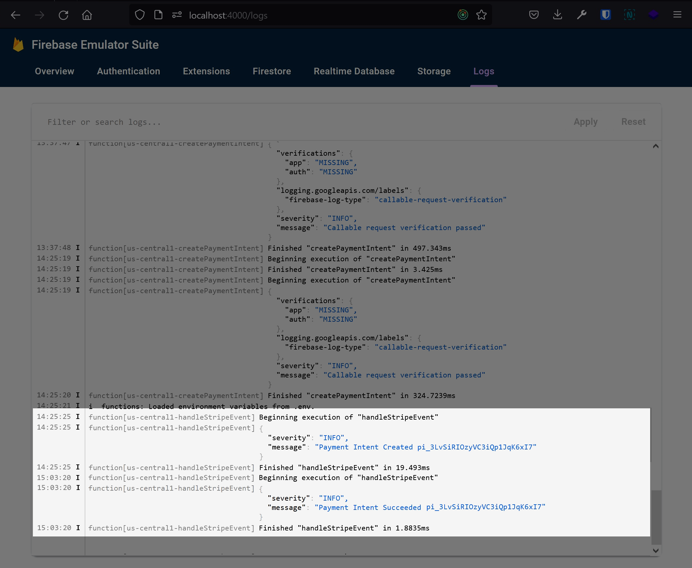

Awesome!

Let's try once more with canceling a Payment Intent

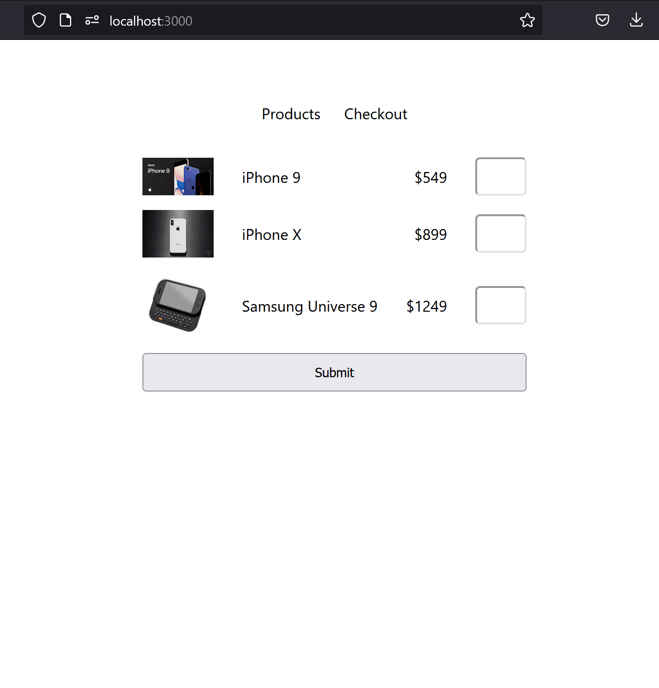
Stripe Dashboard

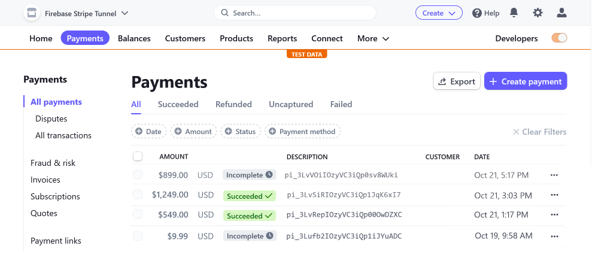

Cancel the Payment Intent
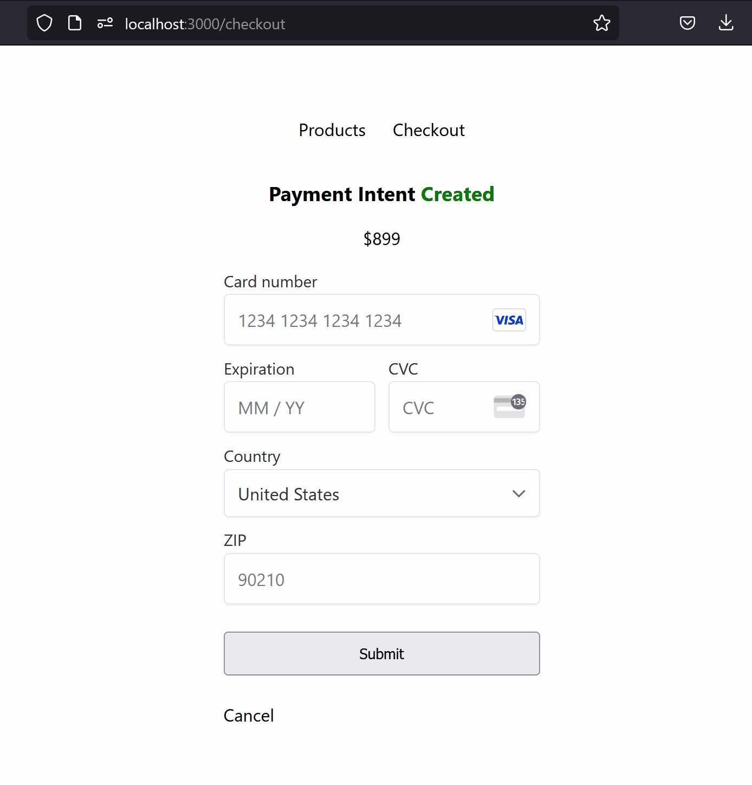

Stripe Dashboard
)

Firebase emulator logs
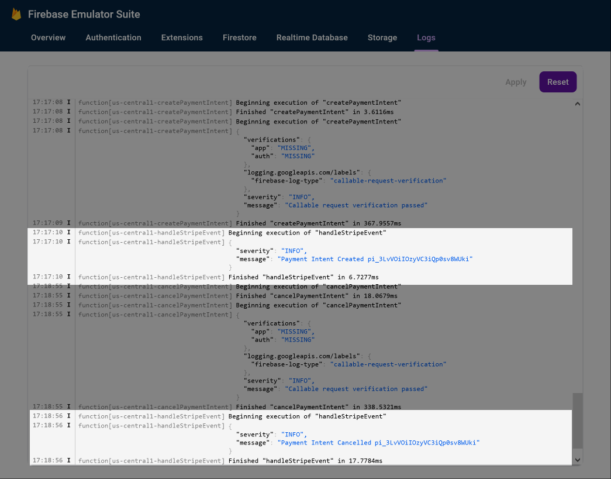

## Final Thoughts

I hope this helps someone make the connection between Firebase cloud functions and Stripe webhooks in the local environment. Thanks for reading!
